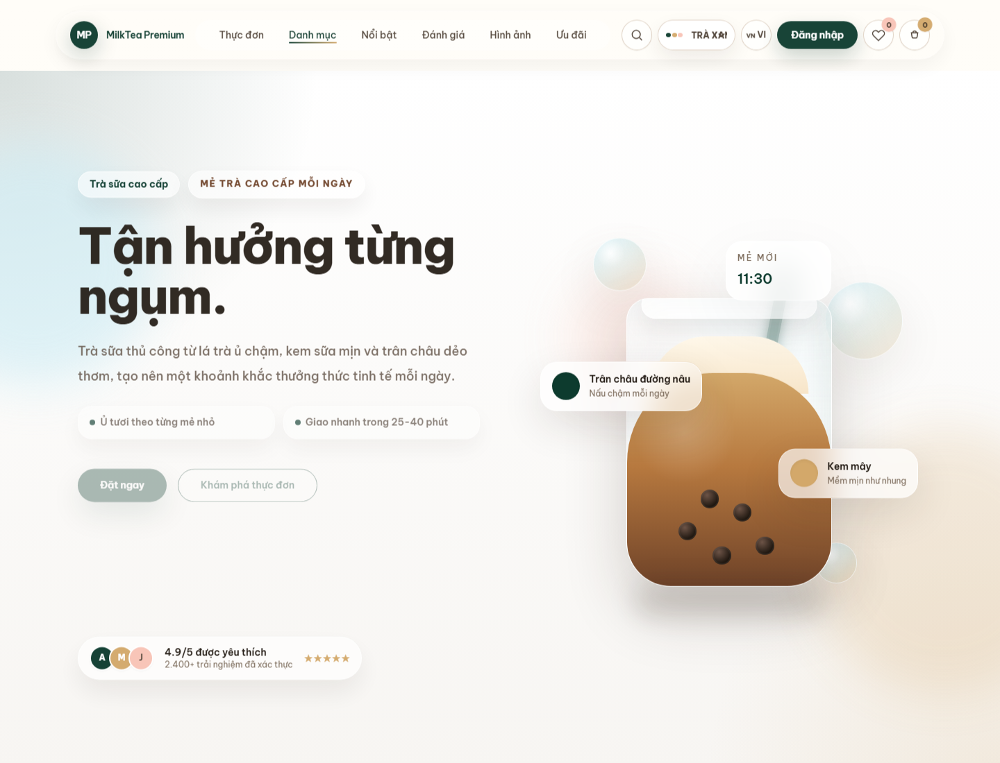
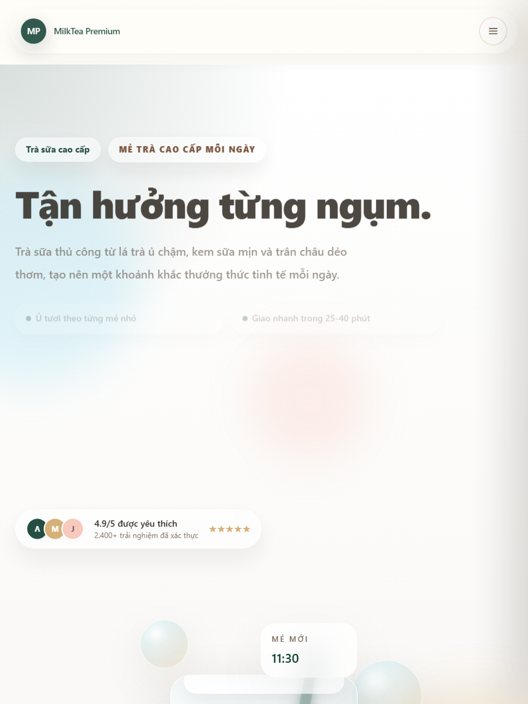
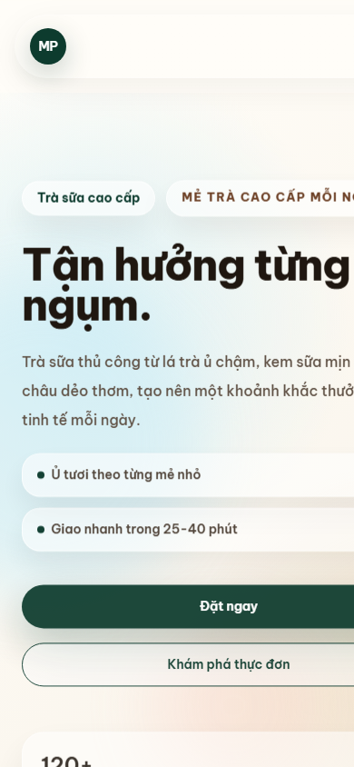
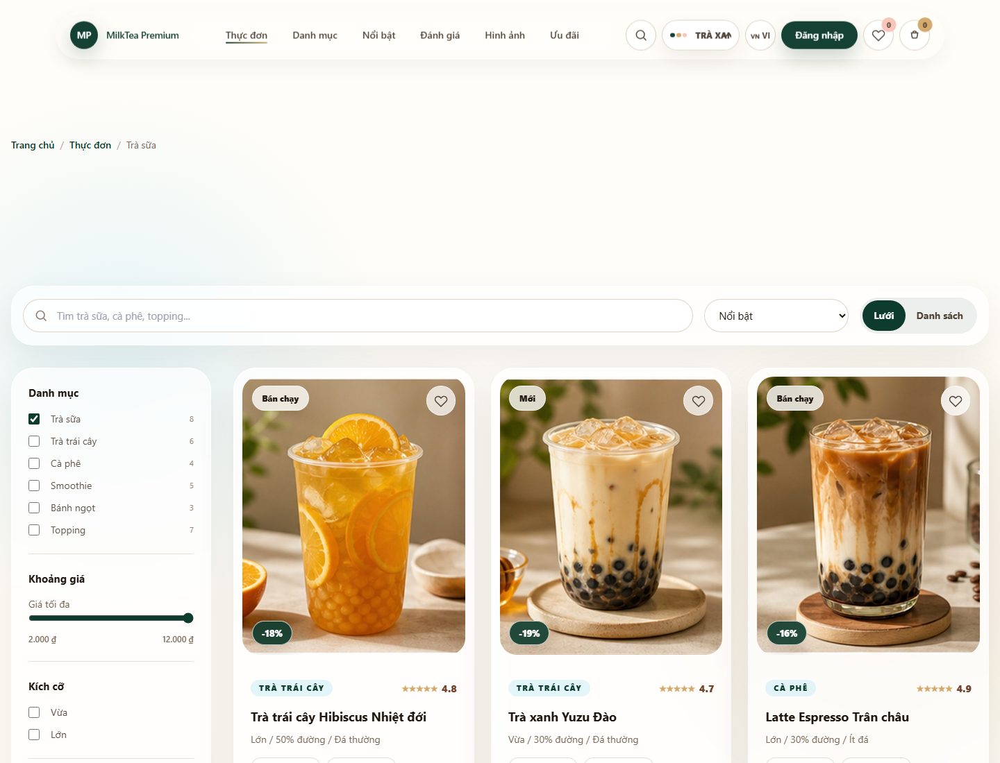
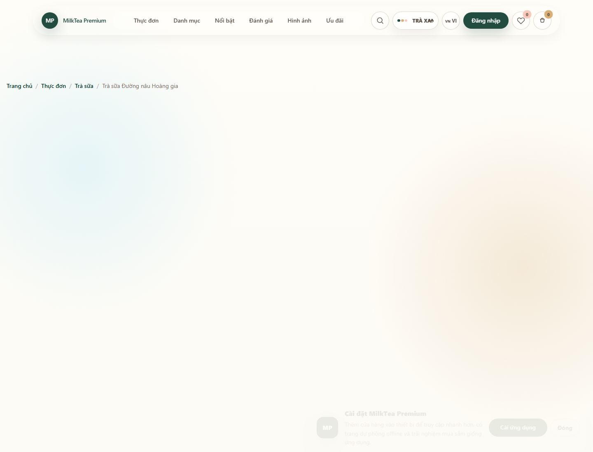
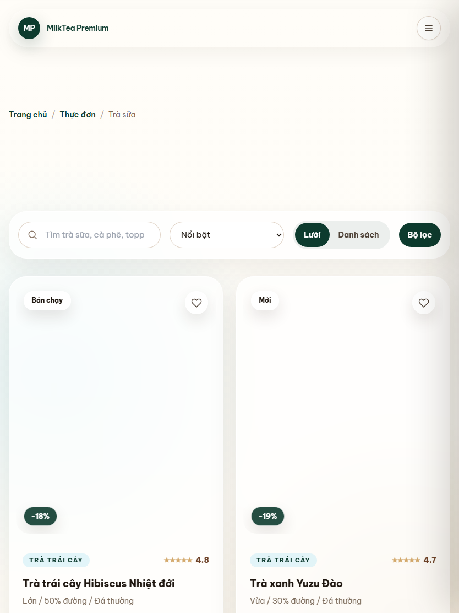

# MilkTea Premium

<p align="center">
  <strong>A premium bubble tea commerce template built with Vite, Vanilla JavaScript, Tailwind CSS, and SPA architecture.</strong>
</p>

<p align="center">
  <a href="#installation"></a>
  <a href="#tech-stack"></a>
  <a href="#tech-stack"></a>
  <a href="LICENSE"></a>
</p>

<p align="center">
  
  
  
  
</p>


## Hero

MilkTea Premium is a polished commercial storefront template for bubble tea, dessert, and cafe brands that need a fast, responsive, multilingual shopping experience without a backend dependency.

## Live Demo

<p>
  <a href="https://milktea-premium.example/"><strong>View Live Demo</strong></a>
  ·
  <a href="https://github.com/your-username/milktea-premium"><strong>View on GitHub</strong></a>
</p>

> Replace the demo and repository URLs with your production links before publishing.

## Screenshots

| View | Preview |
| --- | --- |
| Desktop |  |
| Tablet |  |
| Mobile |  |
| Light Mode |  |
| Dark Mode |  |
| Vietnamese |  |
| English |  |

Additional captures are available in `screenshots/desktop`, `screenshots/tablet`, and `screenshots/mobile`.

## Features

- Modern premium UI for bubble tea, cafe, and dessert storefronts.
- Vanilla JavaScript SPA router with route-level code splitting.
- Multilingual i18n architecture with Vietnamese and English support.
- Theme engine with light, dark, and branded palettes.
- Wishlist, cart, checkout, quick view, and product detail flow.
- Responsive layouts for desktop, tablet, and mobile.
- SEO metadata, canonical URLs, OpenGraph, Twitter Cards, sitemap, and robots file.
- PWA manifest, service worker, offline page, install support, and app icons.
- Accessibility-focused landmarks, labels, focus states, and reduced-motion support.
- CMS-ready business content layer through `siteConfig`.
- Lightweight admin configuration panel powered by localStorage.
- Deployment-ready configs for Netlify, Vercel, and GitHub Pages.

## Tech Stack

| Technology | Description |
| --- | --- |
| Vite | Fast local development, optimized production builds, and native ES module workflow. |
| Vanilla JavaScript | Framework-free SPA architecture with reusable modules, stores, services, and repositories. |
| Tailwind CSS | Utility-first styling with a premium design system and reusable UI patterns. |
| GSAP | Subtle production animations with reduced-motion safeguards. |
| localStorage | Persistent cart, wishlist, theme, language, search, and admin configuration. |
| Vitest | Test-ready architecture for unit, integration, and component coverage. |
| PWA APIs | Manifest, service worker, offline fallback, and installable app support. |

## Folder Structure

```text
milktea-premium/
├── public/
│   ├── assets/
│   ├── icons/
│   ├── manifest.json
│   ├── offline.html
│   ├── robots.txt
│   ├── sitemap.xml
│   └── sw.js
├── src/
│   ├── assets/
│   ├── components/
│   ├── config/
│   ├── constants/
│   ├── data/
│   ├── design/
│   ├── layouts/
│   ├── locales/
│   ├── pages/
│   ├── repositories/
│   ├── services/
│   ├── store/
│   ├── utils/
│   ├── App.js
│   └── main.js
├── tests/
├── docs/
├── screenshots/
├── demo/
├── netlify.toml
├── vercel.json
└── vite.config.js
```

## Installation

Install dependencies:

```bash
npm install
```

Start development:

```bash
npm run dev
```

Create a production build:

```bash
npm run build
```

Preview the production build:

```bash
npm run preview
```

Build for GitHub Pages SPA fallback:

```bash
npm run build:github-pages
```

## Customization

| Area | File |
| --- | --- |
| Logo and brand name | `src/config/siteConfig.js` |
| Theme palettes | `src/store/themeStore.js` |
| Language content | `src/locales/vi.js`, `src/locales/en.js` |
| Products | `src/data/products.js` |
| Categories and filters | `src/data/categories.js` |
| Business information | `src/config/siteConfig.js` |
| Images | `src/assets/images/` and `public/assets/` |
| SEO domain and metadata | `src/config/siteConfig.js`, `public/sitemap.xml`, `public/robots.txt` |

For deeper guidance, see [CUSTOMIZATION.md](CUSTOMIZATION.md) and [DEPLOY.md](DEPLOY.md).

## Roadmap

### v1.0

- Final commercial storefront release.
- Production deployment presets.
- Complete responsive demo screenshots and marketplace preview assets.
- Accessibility, SEO, PWA, and documentation hardening.

### v1.1

- Expanded test coverage for cart, checkout, i18n, and routing.
- Additional product listing layouts.
- More theme presets and marketplace-ready demo variations.

### v2.0

- Optional API/CMS adapter.
- Backend checkout integration hooks.
- Account dashboard and order history architecture.
- Advanced analytics and campaign configuration.

## License

MilkTea Premium is released under the [MIT License](LICENSE).

## Author

- GitHub: [your-username](https://github.com/your-username)
- Email: `hello@example.com`
- Website: `https://your-website.example`

Replace the author placeholders with your commercial profile before publishing.
